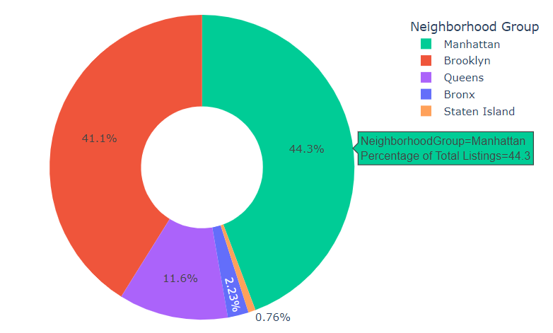

# New-York-City-Airbnb-Analysis: Project Overview
New York City Airbnb Market Analysis and Price Prediction
Analyzing the dynamic NYC Airbnb market: Predicting prices, exploring geographical trends, and understanding key factors. Utilized predictive modeling and interactive dashboards for comprehensive insights. Team project by [@Nihith Nath Kandikattu](https://github.com/nihith-nath), [@Keerthana Allam](https://github.com/Keerthana-Allam), [@Hithesh Kumar Duttuluri](https://github.com/hith777), and Charan Sai Pandaraboyina.

# Problem Statement   

In the ever-changing landscape of the New York City Airbnb market, our project aims to analyze data and predict prices, offering valuable insights for potential investors and discerning customers. Our main goal is to discover patterns that reveal areas with the highest number of listings, understand the factors influencing different costs, and grasp the preferences of both hosts and guests. By exploring the complex interactions between neighborhood characteristics, seasonal demand, and pricing dynamics, our research aims to equip new investors with decision-making tools and provide customers with a strategic advantage in selecting listings based on their preferences and budget constraints. This project provides a comprehensive understanding for hosts and guests, offering a valuable resource for strategic decision-making in the dynamic and popular Airbnb market.   

## Key  Focus  Areas:   
Investigating geographical distribution, pricing  dynamics, customer experiences, and  availability patterns in the dataset to inform strategic decisions for both hosts and guests to enhance the overall Airbnb experience.  

## Data Utilization:   
Employing latitude/longitude coordinates for geographical visualization and analyzing essential metrics such as price, reviews, and availability to derive meaningful insights from the dataset.  

# Code and Resources Used:   
## Dataset   
The dataset was obtained from [Kaggle](https://www.kaggle.com/datasets/thedevastator/airbnbs-nyc-overview). It comprises a dataset of size [48896*16] with columns including listing names, host details, location coordinates, pricing, and availability metrics.   

**Python Version:** 3.10   

**Packages:** sqlite3, pandas, numpy, tabulate, folium, matplotlib, seaborn, plotly, dash, scikit-learn, scipy

# Metadata   

| Column Name                    | Description                                           |   
| ------------------------------ | ----------------------------------------------------- |   
| listing_id                     | The unique id of the Airbnb listing. (Integer)        |   
| listing_name                   | The name of the Airbnb listing. (String)              |
| host_id                        | The id of the host of the Airbnb listing. (Integer)   |
| host_name                      | The name of the host of the Airbnb listing. (String)  |
| neighbourhood_grp              | The neighbourhood group the Airbnb listing is located in. (String) |
| Neighborhood                   | Neighborhood information for each listing (String)    |
| latitude                       | The latitude coordinate of the Airbnb listing. (Float) |
| longitude                      | The longitude coordinate of the Airbnb listing. (Float)|
| room_type                      | The type of room offered by the Airbnb listing. (String)|
| price                          | The price per night of the Airbnb listing. (Integer)  |
| minimum_nights                 | The minimum number of nights required for booking the Airbnb listing. (Integer) |
| number_of_reviews              | The total number of reviews the Airbnb listing has received. (Integer) |
| last_review                    | The date of the last review the Airbnb listing has received. (Date) |
| reviews_per_month              | The average number of reviews the Airbnb listing receives per month. (Float) |
| calculated_host_listings_count | The total number of listings the host has. (Integer)  |
| availability_365               | The number of days the Airbnb listing is available for booking in a year. (Integer) |   

# Data Cleaning
• Parsed the TSV file to extract the header and listing data.   
• Cleaned the data by renaming columns, removing unwanted columns, and handling missing values.   
# Normalization
• Created an SQLite database and set up tables for Host, Neighborhood, and Listings.   
• Normalized the data to eliminate transitive dependencies, improving data integrity.    
• We have created a normalized database comprising 3 tables: a Host Table (HostID primary key), a Neighborhood Table (NeighborhoodID primary key), and a Listing Table (ListingID primary key) that has both HostID and NeighborhoodID as Foreign keys.   

    

   
## Host Table:    

| Column Name                    | Description                                           |   
| ------------------------------ | ----------------------------------------------------- |  
| HostID                      | The id of the host of the Airbnb listing. (Integer)   |
| HostName                      | The name of the host of the Airbnb listing. (String)  |
| NumberOfListings| The total number of listings the host has. (Integer)  |

## Neighborhood Table:    

| Column Name                    | Description                                           |   
| ------------------------------ | ----------------------------------------------------- |  
|NeighborhoodID                   | The id of the neighbourhood of the Airbnb listing. (Integer)   |
| Neighborhood                   | Neighborhood information for each listing (String)    |
| neighbourhood_grp              | The neighbourhood group the Airbnb listing is located in. (String) |

## Listing Table:    

| Column Name                    | Description                                           |   
| ------------------------------ | ----------------------------------------------------- |  
| ListingID                    | The unique id of the Airbnb listing. (Integer)        |   
| ListingName                | The name of the Airbnb listing. (String)              |
| HostID                      | The id of the host of the Airbnb listing. (Integer)   |
|NeighborhoodID                   | The id of the neighbourhood of the Airbnb listing. (Integer)   |
| latitude                       | The latitude coordinate of the Airbnb listing. (Float) |
| longitude                      | The longitude coordinate of the Airbnb listing. (Float)|
|  ListingType                      | The type of room offered by the Airbnb listing. (String)|
| price                          | The price per night of the Airbnb listing. (Integer)  |
| MinimumNights               | The minimum number of nights required for booking the Airbnb listing. (Integer) |
| NumberOfReviews             | The total number of reviews the Airbnb listing has received. (Integer) |
| MonthlyReviewRate             | The average number of reviews the Airbnb listing receives per month. (Float) |
| Availability_365               | The number of days the Airbnb listing is available for booking in a year. (Integer) |  

# Exploratory Data Analysis (EDA)   
In this phase, we delve into the Airbnb dataset for New York City, aiming to uncover meaningful patterns, trends, and insights that lay the groundwork for informed decision-making.    
## 1. Donut Chart: Airbnb Listings Distribution by Neighborhood Groups.      
Manhattan and Brooklyn dominate the NYC Airbnb market, commanding over 80%. Manhattan leads with 44.3%, followed closely by Brooklyn at 41.1%. This concentration underscores their significance for investors and travelers alike.    
  
## 2. Stacked Column Chart: Airbnb Listings by Availability and Location   
The chart reveals a significant concentration of listings (40%) within the 0-20 days availability bin, emphasizing a robust presence of short-term rental options. This insight is crucial for those seeking dynamic and flexible accommodation choices in the city.   
     
## 3. Horizontal Bar Chart: Airbnb Listings by Type    
"Entire home/apt" dominates Airbnb listings at 52%, followed by "Private room" at 45.6%, and "Shared room" at just 2.37%. The data underscores a clear preference for entire home rentals in the NYC market.   
          
## 4. Scatter Plot: Price Distribution by Room Type and Neighborhood Group    
The plot provides a clear visual understanding of the price range for each listing type. This insight aids potential guests in assessing accommodation options based on their budget and preferences.    
    
## 5. Scatter Map Plot: Geographical Distribution of NYC Airbnb Listings    
The plot provides an insightful visualization of the diverse geographical distribution of listings. The color-coded markers offer a quick identification of different room types, aiding users in assessing location preferences for their Airbnb stay.   
    
## 6. Bar Chart: Average Listing Prices by Neighborhood Groups in NYC    
Manhattan stands out with the highest average listing price, reaching around $197. This insight emphasizes the diverse pricing landscape across NYC neighborhoods, providing valuable information for potential guests and investors.   
    
## 7. Scatter Plot/Density Heat Map: Concentration and Pricing Variations in NYC Listings   
Observing the visualization, it's evident that Manhattan and Brooklyn exhibit higher-priced and densely concentrated listings. This spatial insight is crucial for understanding the pricing dynamics and popular locations within the vibrant NYC landscape.    
    
# Combining Data and Correlation Analysis:
• Combined data from normalized database tables.    
• Analyzed the correlation matrix to identify relationships between variables.    
• Strong Negative Co-relation of Listing Type and Longitude Predictors with Price has been observed.    
    
# Conclusion    
In conclusion, our project conducted an in-depth analysis of the dynamic New York City Airbnb market, revealing significant 
insights. We meticulously explored room availability, categorized neighborhoods, and pinpointed locations near key tourist 
attractions and below are our key findings and insights.    
## KEY FINDINGS:    
**Geographical Trends:**    
• Manhattan and Brooklyn are the most dominant areas in terms of both listing count and prices.    
• Airbnb listings are densely concentrated around popular tourist spots, including Times Square, the Empire State Building, and Central Park.    
**Listing Type:**    
• Entire apartments are the most popular listing type in New York City.    
**Availability Analysis:**    
• Most Airbnb listings exhibit limited availability throughout the year.    
• The scarcity of short-term rentals in NYC contributes to elevated prices.    
**Correlation Analysis:**    
• The correlation matrix suggests that the prices of Airbnb listings in NYC are majorly influenced by the listing type and longitude, suggesting there is a notable relationship between the type of listing (such as entire home/apartment or private room) and the geographical location (longitude) with the pricing of the listings.    

  

